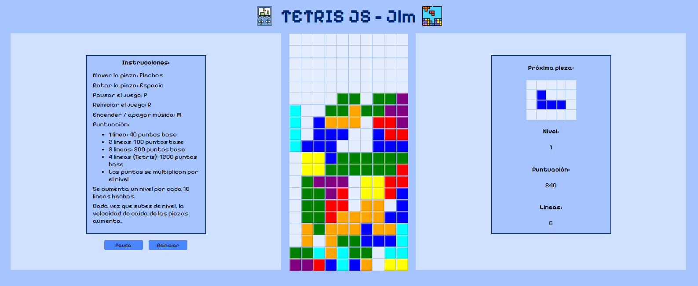

# Tetris JS - Jlm

**Tetris Game** is a classic falling block puzzle game implemented using HTML, CSS, and JavaScript. Players must rotate and arrange the falling tetrominoes (the pieces) to complete horizontal lines, which will then disappear, increasing the score. The game progressively increases in speed, making it more challenging as you advance.

## Live Demo:
https://jolumo1.github.io/Tetris_Javascript/
 

 

## Features:
- **Classic Tetromino Shapes**: Includes all seven standard Tetris pieces (I, J, L, O, S, T, Z).
- **Next Piece Preview**: Shows the next tetromino to help players plan their moves.
- **Score & Level System**: The game tracks your score and increases speed with higher levels.
- **Smooth Controls**: Move, rotate, and drop pieces with arrow keys.
- **Game Over Detection**: Ends the game when the stack reaches the top.
- **Background Music & Sound Effects**: Playable with adjustable sound settings.

## How It Works:
1. **Move and Rotate**: Use the keyboard to control pieces:
   - Left Arrow: Move left
   - Right Arrow: Move right
   - Down Arrow: Soft drop
   - Spacebar: Rotate piece
   - "P": Pause/Resume
   - "R": Restart game
   - "M": Toggle background music
2. **Clear Lines**: Complete horizontal rows to clear them and gain points.
3. **Level Up**: The game speeds up as you clear more lines.
4. **Game Over**: If pieces stack to the top, the game ends.

## Technologies Used:
- **HTML**: Structure of the game interface.
- **CSS**: Styling and grid layout.
- **JavaScript**: Game logic, movement handling, collision detection, and scoring system.
- **SweetAlert**: Used for game-over messages.
- **Audio Elements**: Background music and sound effects.

## How to Play:
- Use the arrow keys to move and rotate the tetrominoes.
- Complete full horizontal lines to clear them and earn points.
- The game speeds up as you level up.
- Avoid stacking blocks to the top; otherwise, it's game over.

## Installation:
- Clone or download the repository to your local machine, then open the index.html file in your web browser to start playing.
- Use the Github Pages version: https://jolumo1.github.io/Tetris_Javascript/

